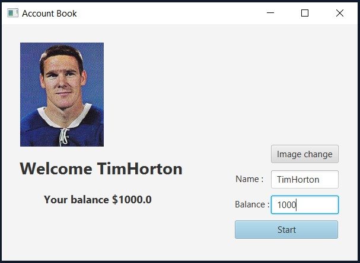
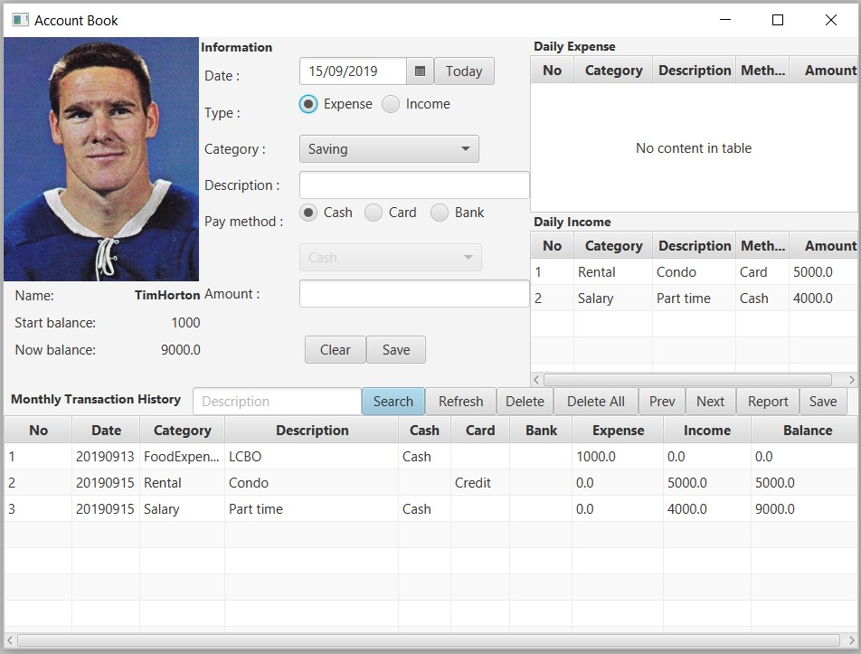
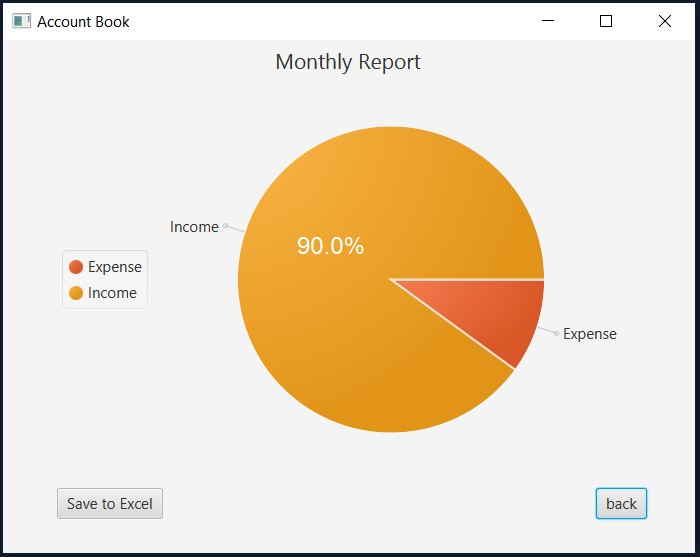
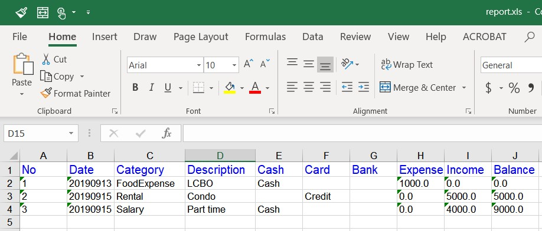

# Account Book
## 1. Index Page
> - Image change
> - Save name and balance

## 2. Main Page
> - save information about expense and income
> - navigator the stored information

## 3. Report Page
> - display pie chart from the information
> - when click the chart, it showed the exact percentage number

## 4. Excel Page
> - download the excel file

## Technologies
> Java, JavaFXML, Scene Builder, POI, MVC pattern